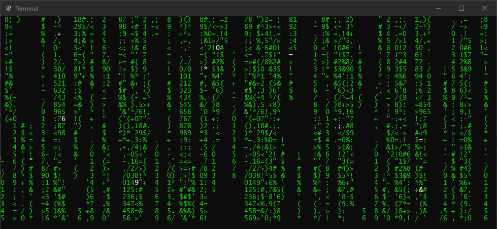

# Matrix

Generates text in a console window to emulate the text displayed in [The Matrix (1999)](https://www.imdb.com/title/tt0133093/).

I lost the original c++ code I wrote for the initial version I made in 2013, I've tried to replicate it as best I can in dotnet core.

## Releases

- [28/12/2019](./binaries/2019-12-28.zip) - Rewritten for dotnet core 3.1
- [04/10/2013](./binaries/2013-10-04.zip) - Original C++ Version
